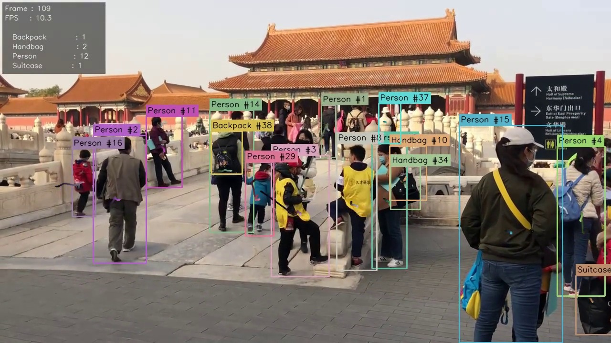
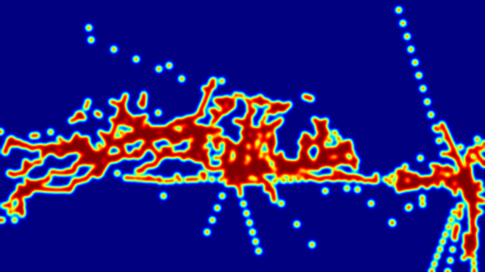

# Real-Time Multi-Object Tracking in Video Using Deep Learning

A production-quality multi-object tracking system that combines **YOLOv8** object detection with a **DeepSORT-style tracker** to detect, identify, and follow multiple objects across video frames — with full analytics output.

---

## Demo

### Tracked Output Frame


### Motion Density Heatmap


> **Classes tracked:** Person · Handbag · Backpack · Suitcase · Car · Truck · Motorcycle · Traffic Light · Stop Sign

---

## Key Features

- **Two-stage matching** — cosine appearance matching for confirmed tracks, IoU matching as fallback
- **Kalman filter motion model** — smooth bbox prediction between detections, handles occlusion
- **MobileNetV2 ReID embeddings** — 128-dim L2-normalised appearance features with EMA smoothing
- **Class-aware matching** — prevents cross-class ID swaps (a bag never inherits a person's ID)
- **Spatial gating** — class-specific distance thresholds prevent implausible long-range matches
- **Ghost-trail suppression** — trajectory only extrapolated for short occlusions (≤3 frames)
- **GPU acceleration** — YOLO and feature extractor both run on CUDA when available
- **Rich analytics output** — 6 charts + per-class heatmaps generated automatically

---

## Architecture

```
Input Video
    │
    ▼
┌─────────────────────────────┐
│   YOLOv8l  (Detection)      │  ← GPU accelerated
│   conf=0.25 · NMS IoU=0.75  │
└────────────┬────────────────┘
             │  boxes + class labels
             ▼
┌─────────────────────────────┐
│  MobileNetV2 ReID Extractor │  ← GPU accelerated
│  128-dim · L2-normalised    │
└────────────┬────────────────┘
             │  appearance features
             ▼
┌─────────────────────────────────────────────────┐
│              DeepSORT Tracker                   │
│                                                 │
│  1. Kalman predict all active tracks            │
│  2. Stage 1 — Appearance match (confirmed)      │
│     • Cosine distance + class gate              │
│     • Spatial center-distance gate              │
│     • Hungarian algorithm                       │
│  3. Stage 2 — IoU match (tentative + unmatched) │
│     • Class gate + Hungarian algorithm          │
│  4. Spawn new tracks for unmatched detections   │
│  5. Mark missed tracks → delete after 15 frames │
└────────────┬────────────────────────────────────┘
             │  confirmed tracks
             ▼
┌─────────────────────────────┐
│  Visualisation + Analytics  │
│  • Annotated video          │
│  • Motion heatmap           │
│  • 6 analytics charts       │
│  • CSV tracking log         │
└─────────────────────────────┘
```

---

## Results

| Metric | Value |
|---|---|
| Video resolution | 1280 × 720 |
| FPS (GPU) | ~10 FPS |
| Unique persons tracked | 26 |
| Unique handbags tracked | 19 |
| Unique backpacks tracked | 6 |
| Total unique object IDs | 53 |

---

## Output Files

| File | Description |
|---|---|
| `outputs/output_tracked.mp4` | Annotated video with bounding boxes and trajectory trails |
| `outputs/motion_heatmap.png` | JET-colorised density map of all object movement |
| `outputs/tracking_results.csv` | Per-frame log: `frame_id, track_id, label, x1, y1, x2, y2` |
| `outputs/summary_report.txt` | Total frames, FPS, unique object counts per class |
| `outputs/count_over_time.png` | Line chart — active tracks per class across all frames |
| `outputs/track_lifetimes.png` | Histogram — how long each track survived (tracking stability) |
| `outputs/trajectory_map.png` | All movement paths on a dark canvas, one colour per track |
| `outputs/unique_counts_bar.png` | Horizontal bar chart of total unique objects per class |
| `outputs/class_distribution_pie.png` | Pie chart of object class proportions |
| `outputs/heatmap_person.png` | Density heatmap for people only |
| `outputs/heatmap_handbag.png` | Density heatmap for handbags only |
| `outputs/heatmap_backpack.png` | Density heatmap for backpacks only |

---

## Project Structure

```
multi-object-tracker/
├── main.py                          # CLI entry point
├── requirements.txt
├── src/
│   ├── config.py                    # All hyperparameters (dataclass)
│   ├── pipeline.py                  # End-to-end tracking pipeline
│   ├── tracker/
│   │   ├── track.py                 # Single-track: Kalman filter + state machine
│   │   ├── tracker.py               # DeepSortTracker: two-stage matching
│   │   └── feature_extractor.py    # MobileNetV2 ReID embeddings (PyTorch)
│   └── utils/
│       ├── visualization.py         # Bounding boxes, trails, overlay stats
│       ├── io.py                    # CSV writer
│       └── reporting.py            # Heatmaps + 6 analytics charts
└── outputs/                         # All generated files
```

---

## Installation

```bash
# Clone the repository
git clone https://github.com/mnansari370/Real-Time-Multi-Object-Tracking-in-Video-Using-Deep-Learning.git
cd Real-Time-Multi-Object-Tracking-in-Video-Using-Deep-Learning

# Create and activate a conda environment
conda create -n tracker_env python=3.10 -y
conda activate tracker_env

# Install dependencies
pip install -r requirements.txt
```

> **GPU note:** Install PyTorch with the CUDA version matching your driver.
> Check your CUDA version with `nvidia-smi`, then visit [pytorch.org](https://pytorch.org/get-started/locally/) for the correct install command.
> Example for CUDA 12.4: `pip install torch torchvision --index-url https://download.pytorch.org/whl/cu124`

---

## Usage

```bash
# Basic usage
python main.py --video path/to/video.mp4

# Custom options
python main.py \
  --video path/to/video.mp4 \
  --model yolov8l.pt \          # yolov8n / yolov8s / yolov8m / yolov8l / yolov8x
  --conf 0.25 \                 # detection confidence threshold
  --classes person handbag \    # track only specific classes
  --no-trajectory \             # disable trajectory trail rendering
  --output my_output.mp4        # custom output path
```

---

## Configuration

All hyperparameters are centralised in [`src/config.py`](src/config.py):

| Parameter | Default | Description |
|---|---|---|
| `yolo_model` | `yolov8l.pt` | YOLO model size |
| `confidence_threshold` | `0.25` | Minimum detection confidence |
| `nms_iou_threshold` | `0.75` | NMS IoU — higher keeps more overlapping detections |
| `appearance_threshold` | `0.40` | Max cosine distance for appearance match |
| `iou_threshold` | `0.25` | Min IoU for fallback match |
| `max_missed_frames` | `15` | Frames before a track is deleted |
| `min_confirmed_age` | `2` | Detections required to confirm a track |
| `trajectory_length` | `30` | Max trail length in frames |

---

## Tech Stack

| Component | Technology |
|---|---|
| Object Detection | [Ultralytics YOLOv8](https://github.com/ultralytics/ultralytics) |
| Tracking Algorithm | DeepSORT (custom implementation) |
| Appearance Embeddings | MobileNetV2 — [torchvision](https://pytorch.org/vision/) |
| Motion Model | Kalman Filter — [filterpy](https://github.com/rlabbe/filterpy) |
| Assignment | Hungarian Algorithm — [scipy](https://scipy.org/) |
| Video I/O | OpenCV + imageio-ffmpeg |
| Analytics | Pandas + Matplotlib |

---

## How It Works

### Detection
YOLOv8l runs on every frame with a confidence threshold of 0.25 and a high NMS IoU of 0.75. The high NMS threshold is intentional — it prevents nearby people from being merged into a single detection box.

### Feature Extraction
Each detection crop is resized to 128×128, passed through a frozen MobileNetV2 backbone, projected to 128 dimensions, and L2-normalised. Features are updated using an **Exponential Moving Average** (α=0.75) to smooth out noisy crops from partial occlusions.

### Two-Stage Matching
1. **Stage 1 (Appearance):** Confirmed tracks are matched to detections using cosine distance (Hungarian algorithm), gated by class label and center-distance radius (1.5× bbox for small objects, 2.5× for large).
2. **Stage 2 (IoU):** Tentative tracks and unmatched confirmed tracks are matched using IoU, also gated by class label.

### Track Lifecycle
- **TENTATIVE** → confirmed after 2 consecutive detections  
- **CONFIRMED** → displayed with bounding box + trajectory  
- **DELETED** → removed after 15 consecutive missed frames

---

## License

MIT License — free to use for academic and personal projects.
